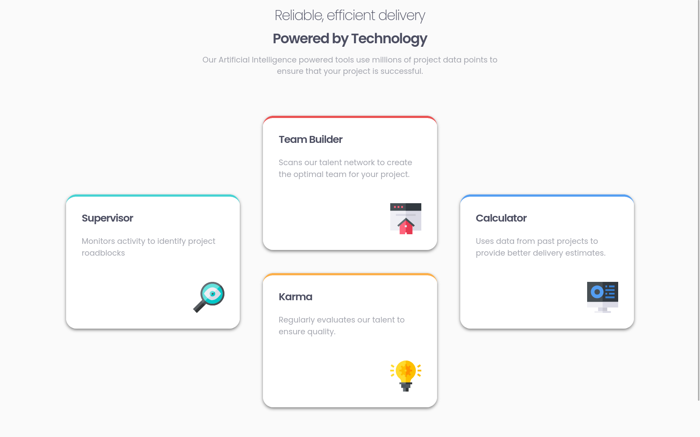

# Frontend Mentor - Four card feature section solution

This is a solution to the [Four card feature section challenge on Frontend Mentor](https://www.frontendmentor.io/challenges/four-card-feature-section-weK1eFYK). Frontend Mentor challenges help you improve your coding skills by building realistic projects.

## Table of contents

- [Frontend Mentor - Four card feature section solution](#frontend-mentor---four-card-feature-section-solution)
  - [Table of contents](#table-of-contents)
  - [Overview](#overview)
    - [The challenge](#the-challenge)
    - [Screenshot](#screenshot)
    - [Links](#links)
  - [My process](#my-process)
    - [Built with](#built-with)
    - [What I learned](#what-i-learned)
    - [Useful resources](#useful-resources)
  - [Author](#author)

## Overview

### The challenge

Users should be able to:

- View the optimal layout for the site depending on their device's screen size

### Screenshot

### Links

- Solution URL: [here](https://github.com/tonmoysarker/fm-four-card-feature-section)
- Live Site URL: [here](https://tonmoysarker.github.io/fm-four-card-feature-section/)

## My process

### Built with

- Semantic HTML5 markup
- CSS custom properties
- Flexbox
- CSS Grid
- Fluid Typography
- Fluid Space

### What I learned

I was following the second learning path and ended up watching Andy Bell's 43min presentaion about "Browsers mentor, not micromanager". And, I was really fascinated by it. So, I tried my hand with CUBE Css here. It was a nasty ride but I learned a lot.

### Useful resources

Rsources mentioned in the second learning path.

## Author

- Frontend Mentor - [@tonmoysarker](https://www.frontendmentor.io/profile/tonmoysarker)
